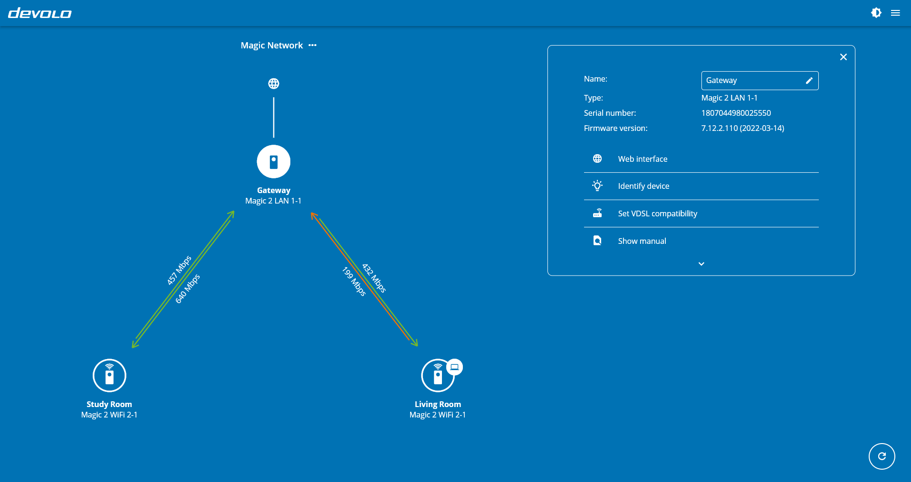

# Cockpit Open Frontend

[](https://gitlab.devolo.intern/dune/cockpit_open_frontend/-/commits/develop)
[](https://gitlab.devolo.intern/dune/cockpit_open_frontend/-/commits/develop)



<br/><br/>
Cockpit Open Frontend is an alternative frontend for devolo Cockpit application.
It uses the existing backend of [devolo Cockpit application.](https://www.devolo.de/support/downloads/download/devolo-cockpit)
It is written in [Flutter](https://flutter.dev) and supports all desktops: Windows, macOS, and Linux. Here are some highlights of this app:
* Provides an overview of connection speed of all powerline adapters from devolo on your network. You can see how high the data transmission is, for example, between the study and the living room.
* If new firmware updates are available for adapters, updates can be applied directly via the network.
* Provides control over encryption and other configuration settings.

## Installation
- Download devolo Cockpit application from https://www.devolo.de/support/downloads/download/devolo-cockpit.
- Install Flutter SDK by following the instructions on https://flutter.dev/docs/get-started/install. 
- Make sure your computer meets the desktop-specific requirements for Flutter development by following the instructions on https://flutter.dev/desktop#requirements.
- Installing Flutter SDK by following the given instructions would require you to setup Android Studio. Although you can use your own code editors, such as Sublime Text and Atom, Flutter recommends using Android Studio, IntelliJ or Visual Studio Code programming IDEs with _Flutter_, _Dart_, and _Flutter Intl_ plugins. Please see https://flutter.dev/docs/get-started/editor for detailed instructions.


### Tips
* To ensure Flutter is setup correctly, you can run the `$ flutter doctor` command in Terminal or Command Prompt.
* To ensure that you have enabled desktop support for your device, run the `$ flutter devices` command in Terminal or Command Prompt.
* For flutter, desktop support must be added separately for each platform. (see: https://docs.flutter.dev/desktop#set-up)
  Foe example for Linux: `$ flutter config --enable-linux-desktop`

## Building and Running the App

To build and run the app on command-line, use the following commands:
```sh
$ cd cockpit_open_frontend
$ flutter run -d <platform>
```
where platform is `windows`, `macos`, or `linux`.

To build and run the app on programming IDEs, see instructions from Flutter for [Android Studio and IntelliJ,](https://flutter.dev/docs/development/tools/android-studio) and [Visual Studio Code.](https://flutter.dev/docs/development/tools/vs-code)  
For Visual Studio Code and Linux users we provide a devcontainer which allows you to start developing inside a container. You need the [devolo Cockpit application](https://www.devolo.de/support/downloads/download/devolo-cockpit) on your host system and you need to run `xhost +local:` if you want to see the UI while debugging.

## Building Releases

* To generate a release build, run the command:
  `$ flutter build <platform>`, where *platform* is `windows`, `macos`, or `linux`.

* The executables and the data folder can be found in:
   * Windows: `…/cockpit_open_frontend/build/windows/runner/Release`
   * macOS: `…/cockpit_open_frontend/build/macos/Build/Products/Release`
   * Linux: `…/cockpit_open_frontend/build/linux/release/bundle`

* Navigate in Terminal or Command Prompt to the above path and run:
   * Windows `devoloCockpit` (Note: Opening the app by double-clicking will result in an error - this is a known limitation of the current implementation.)
   * macOS: `./cockpit_open_frontend.app`
   * Linux: `./devoloCockpit`

## Contributing
If you are interested in contributing to this project, check out [Contributions Guide.](CONTRIBUTING.md)
