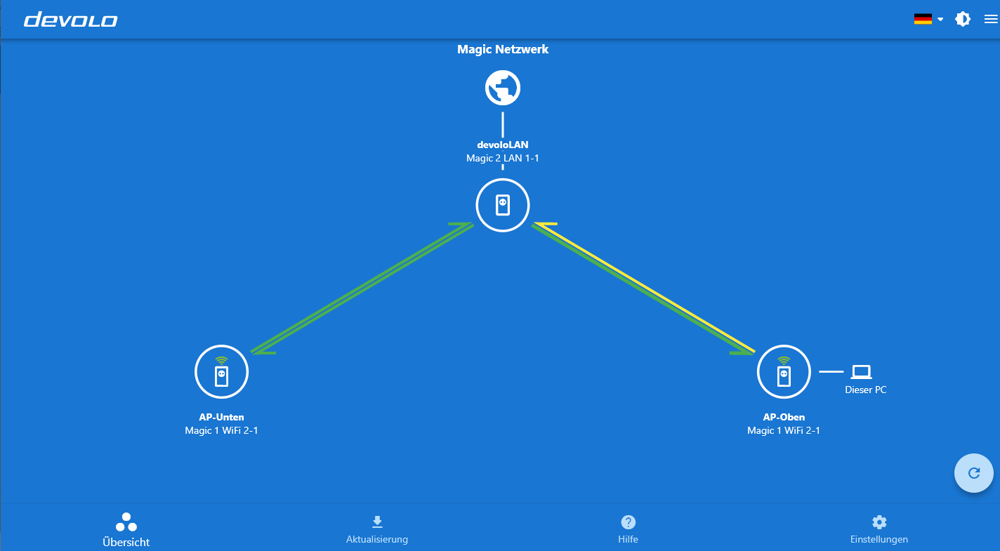

# devolo Cockpit

A devolo Cockpit alternative Flutter front end. This Flutter Cockpit connects with the existing devolo Cockpit backend. 
The program provides information about the connection speed of all adapters on the network. This makes it possible to immediately see how high the data transmission is, for example, between the study and the living room. If new firmware updates are available for our powerline adapters, the update can be applied directly via the network. In addition to status displays, "devolo Cockpit" also provides control over encryption and configuration. A software wizard also provides tips for optimizing the data transfer rate within the powerline home network.

## Getting Started

### Requirements
- devolo Cockpit https://www.devolo.de/support/downloads/download/devolo-cockpit
- Flutter SDK
- Android Studio or Visual Studio Code (with Flutter plugin and Dart plugin)
- more **platform specific** requirements (see: https://flutter.dev/docs/get-started/install)
- flutter **Desktop support** requirements (see: https://flutter.dev/desktop)

### Install Flutter
- flutter installation: https://flutter.dev/docs/get-started/install
- run '*flutter doctor*' in Terminal to verify everything is set up correctly

### Import cockpit_devolo repository
1. Download the repository, following the *Clone or download* button's instructions above and unpack it.
2. Import the project into Android Studio:
   * In Android Studio *File -> New -> Import Project* dialogue.
   * Select *Create project from existing sources* and click next.
   * Continue clicking *next* (leave everything checked).
   * Leave all checkboxes marked and click *Finish*.
3. Select *desktop* in *Flutter device selection* dropdown in Android Studio
5. run '*flutter pub get*' to get all dependencies
4. Click on Icon *Run 'main.dart'*

## Links
- flutter Desktop Support: https://flutter.dev/desktop
- For help getting started with Flutter, view our
[online documentation](https://flutter.dev/docs), which offers tutorials,
samples, guidance on mobile development, and a full API reference.

